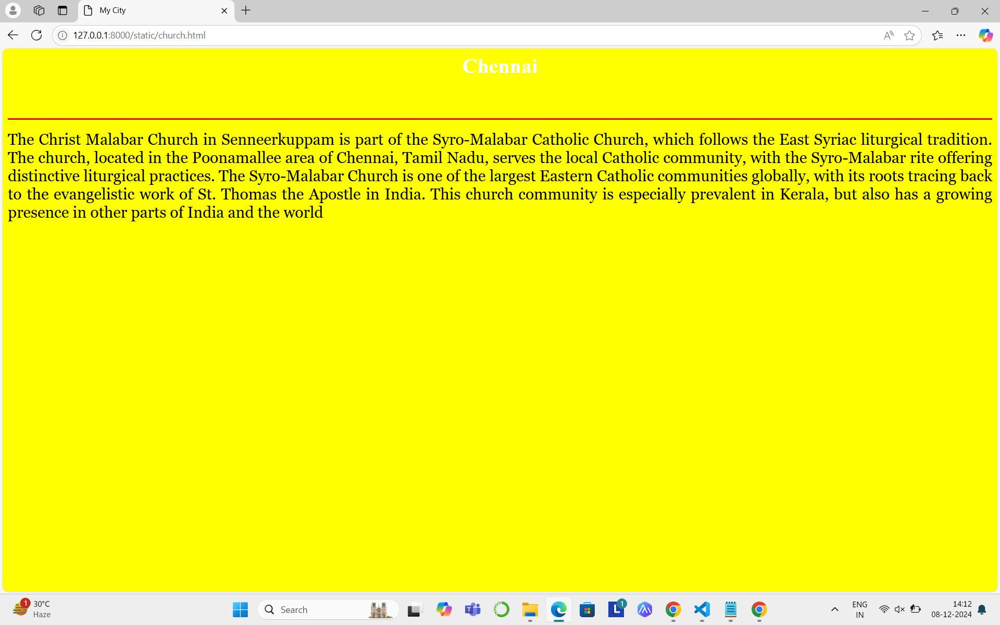

# Ex04 Places Around Me
## Date: 8.12.2024

## AIM
To develop a website to display details about the places around my house.

## DESIGN STEPS

### STEP 1
Create a Django admin interface.

### STEP 2
Download your city map from Google.

### STEP 3
Using ```<map>``` tag name the map.

### STEP 4
Create clickable regions in the image using ```<area>``` tag.

### STEP 5
Write HTML programs for all the regions identified.

### STEP 6
Execute the programs and publish them.

## CODE
```
map.html

<html>
    <head>
        <title> My City</title>
    </head>
    <body>
        <h1 align="center">
            <font color="red"><b>Chennai</b></font>
        </h1>
        <h3 align="center">
            <font color="blue"><b> Sangeetha S (24900442)</b></font>
        </h3>
        <center>
            
            <map name ="MyCity">
                <area title="Sennerkuppam Park" href="park.html" coords="720,170,650,220" shape="rect">
                <area title="S.S.Clinic" href="clinic.html" coords="75,320,55" shape="circle">
                <area title="Christ School" href="school.html" coords="1200,150,1100,100" shape="rect">
                <area title="Hanuman Temple" href="temple.html" coords="920,380,45" shape="circle">
                <area title="Malabar Church" href="church.html" coords="1050,200,1300,250" shape="rect">
            </map>
        </center>
    </body>
</html>

park.html

<html>
    <head>
        <title> My City</title>
    </head>
    <body bgcolor="cyan">
        <h1 align="center">
            <font color="red"><b>Chennai</b></font>
        </h1>
        <h3 align="center">
            <font color="black"><b>Senneerkuppam Park</b></font>
        </h3>
        <hr size="3" color="red">
        <p align="justify">
            <font face="Georgia" size="5">
                In Senneerkuppam, a locality near Poonamallee in Chennai, parks provide recreational spaces for residents. One notable park 
                is Radiance Royale Park, located near the Radiance Royale residential area. This park serves as a community space, 
                offering greenery and a calm environment for relaxation and outdoor activities. Additionally, Senneerkuppam's proximity to
                other parks and recreational facilities in the Poonamallee region makes it a pleasant area for residents seeking outdoor 
                leisure opportunities
            </font>
        </p>
    </body>
</html>

school.html

<html>
    <head>
        <title> My City</title>
    </head>
    <body bgcolor="blue">
        <h1 align="center">
            <font color="black"><b>Chennai</b></font>
        </h1>
        <h3 align="center">
            <font color="white"><b>Christ School-Senneerkuppam</b></font>
        </h3>
        <hr size="3" color="red">
        <p align="justify">
            <font face="Georgia" size="5">
                Christ Matriculation Higher Secondary School, located in Preshitha Nagar, Senneerkuppam, Poonamallee, was established 
                in 1994 under the management of the Carmelites of Mary Immaculate (CMI) Fathers of the Preshitha Province. The 
                institution is part of the Little Flower Educational Society and offers education under the Tamil Nadu Matriculation
                Board. Known for its emphasis on academic excellence and moral values, the school provides a nurturing environment for 
                holistic development. It is affiliated with the legacy of Saint Kuriakose Elias Chavara, emphasizing service to the 
                community through education​

            </font>
        </p>
    </body>
</html>


clinic.html

<html>
    <head>
        <title> My City</title>
    </head>
    <body bgcolor="purple">
        <h1 align="center">
            <font color="black"><b>Chennai</b></font>
        </h1>
        <h3 align="center">
            <font color="white"><b>S.S.Clinic-Senneerkuppam</b></font>
        </h3>
        <hr size="3" color="black">
        <p align="justify">
            <font face="Georgia" size="5">
                SS Clinic in Senneerkuppam, Poonamallee. However, Senneerkuppam, located in the Poonamallee area of Chennai, is home 
                to several small local clinics providing a range of healthcare services. These clinics may offer general medical care, 
                specialized treatments, or even alternative therapies. Many of these clinics may specialize in local health needs and
                 often serve the immediate community. To learn more, you could try visiting or contacting neighboring areas or local 
                 residents for firsthand information.
            </font>
        </p>
    </body>
</html>


church.html

<html>
    <head>
        <title> My City</title>
    </head>
    <body bgcolor="yellow">
        <h1 align="center">
            <font color="white"><b>Chennai</b></font>
        </h1>
        <h3 align="center">
            <font color="yellow"><b>Malabar Church-Senneerkuppam</b></font>
        </h3>
        <hr size="3" color="red">
        <p align="justify">
            <font face="Georgia" size="5">
                The Christ Malabar Church in Senneerkuppam is part of the Syro-Malabar Catholic Church, which follows the East Syriac 
                liturgical tradition. The church, located in the Poonamallee area of Chennai, Tamil Nadu, serves the local Catholic 
                community, with the Syro-Malabar rite offering distinctive liturgical practices. The Syro-Malabar Church is one of the 
                largest Eastern Catholic communities globally, with its roots tracing back to the evangelistic work of St. Thomas the 
                Apostle in India. This church community is especially prevalent in Kerala, but also has a growing presence in other
                 parts of India and the world
            </font>
        </p>
    </body>
</html>


```


## OUTPUT





## RESULT
The program for implementing image maps using HTML is executed successfully.

